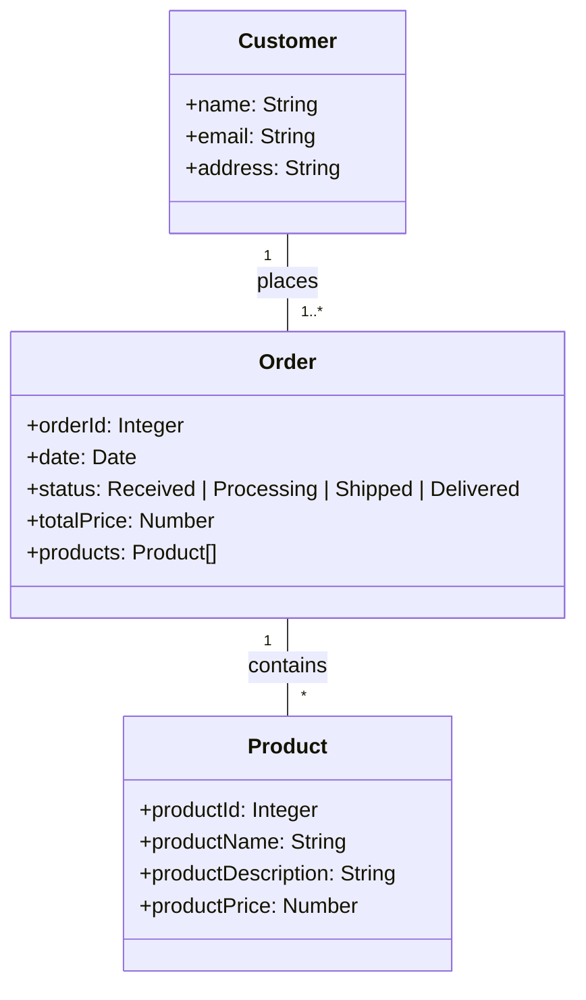

# Help - Prompt Samples

## TodoAPI
Select the code and click on "copilot-> start code chat" and enter the prompt "change the method Get to return a list of TodoModel class with 50 examples different values ​​for completed field"

create a new method to retrieve a TodoModel object by its Id

Chat
create CRUD methods for TodoAPI

Chat
How can I add swagger to my TodoAPI?
How can I add swagger to my TodoAPI using dotnet 7?

## TodoClient
// filter the response to only include TodoModel objects where the Completed property is true

in my todo.api create new method to get only completed todos

in my client project, change the main method to consume the completd method

in my client project, create a method to create todo item

// create a new TodoModel object and call the CreateTodoItem method

## TodoTest
// assert the count of TodoModel objects returned is 50

How can I test the POST and PUT endpoints of my TodoApi using MSTest?

## Copilot Chat
Me: Hello copilot!
Copilot: Hello, World!

## Coplot Enterprise
what is the purpose of this repository?
what projects are contained in this repository?
how can I run this project?
explain the folders in the root of this repository?
Where are the TodoItems listed?
what is the purpose of the TodoModel class?
what is the purpose of the TodoController class?
what is the purpose of the TodoService class?

Attach the student controller file and then -> describe the methods of this controller

## Others Samples

### Mermaid

create a class diagram using mermaid for a flow where a customer makes a purchase in an ecommerce

generate the classes based on the mermaid diagram above in dotnet core 8 language

### Instructor Class

You are a skilled instructor who makes complex topics simple.
You provide your students with fun exercises to complete so they can learn by doing.
You are giving a class on regular expressions using C# and want your students to practice writing regular expressions.
Move one concept at a time and do not move to the next concept until the correct answer is provided.
If the wrong answer is provided, give a helpful hint so the student can try again.
Start

For next instructions, send the keyword "next" in the chat

### Pros and Cons

What are some different ways to implement this database connection logic? Give me the pros and cons of each strategy

### Workspace /new 

@workspace /new criar um novo projeto em dotnet core 6. Esse projeto sera uma rest api. Esse projeto terá um model Pessoa e conexão com o banco de dados. Criar um controller Pessoa para export os metodos crud para os usuários.

### Refactor the code

help me refactor the code in #file

help me refactor the code in #file. Go one step at a time. Do not move to the next step until I give the keyword "next". Start