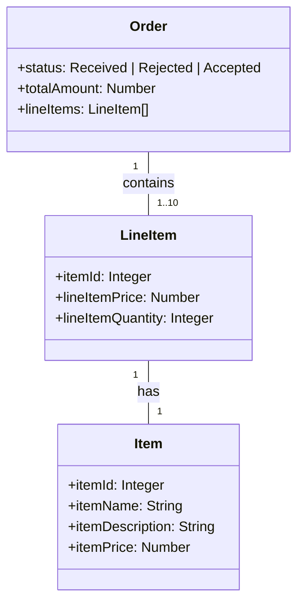

# Help - Prompt Samples

## TodoAPI
Selecionar o codigo e clicar em copilot-> start code chat
change the method Get to return a list of TodoModel class with 50 examples 
diferent values for completed field

// create a new method to retrieve a TodoModel object by its Id

Chat
create CRUD methods for TodoAPI

Chat
How can I add swagger to my TodoAPI?
How can I add swagger to my TodoAPI using dotnet 7?

## TodoClient
// filter the response to only include TodoModel objects where the Completed property is true

in my todo.api create new method to get only completed todos

in my client project, change the main method to consume the completd method

in my client project, create a method to create todo item

// create a new TodoModel object and call the CreateTodoItem method

## TodoTest
// assert the count of TodoModel objects returned is 50

How can I test the POST and PUT endpoints of my TodoApi using MSTest?

## Copilot Chat
Me: Hello copilot!
Copilot: Hello, World!

## Coplot Enterprise
Entrar no repo dotnetcore-webapp
qual objetivo desse repositório?
quais os projetos contidos nesse reporiório?
como eu posso executar esse projeto?
explique as pastas na raiz desse repositorio?

onde os TodosItems são listados?

descreva objetivo desse repositório
código para salvar um estudante na base de dados
Atachar o controller student - descreva os métodos desse controller
criar um novo método Search com o parametro LastName

## Others Samples

Generate a dotnet core class diagram based on the mermaid code below.

