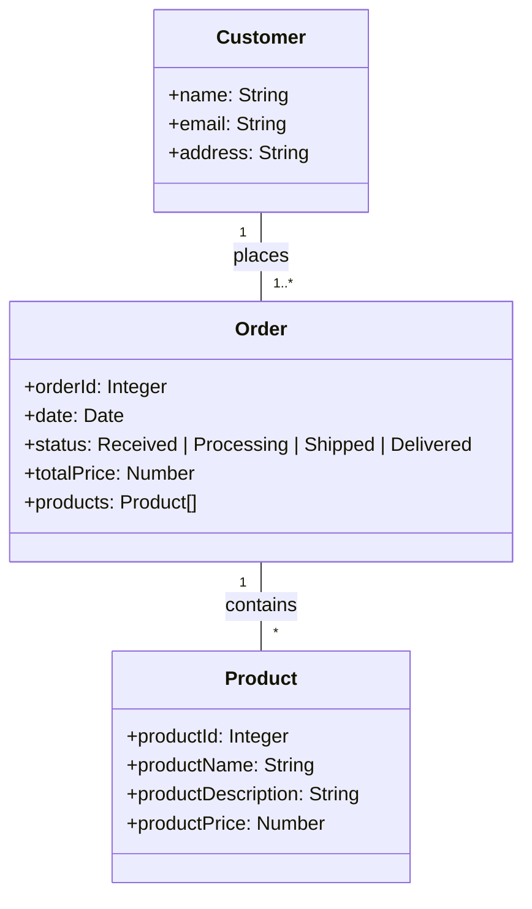

# Help - Prompt Samples

## TodoAPI
Select the code and click on "copilot-> start code chat" and enter the prompt "change the method Get to return a list of TodoModel class with 50 examples different values ​​for completed field"

create a new method to retrieve a TodoModel object by its Id

Chat
create CRUD methods for TodoAPI

Chat
How can I add swagger to my TodoAPI?
How can I add swagger to my TodoAPI using dotnet 7?

## TodoClient
// filter the response to only include TodoModel objects where the Completed property is true

in my todo.api create new method to get only completed todos

in my client project, change the main method to consume the completd method

in my client project, create a method to create todo item

// create a new TodoModel object and call the CreateTodoItem method

## TodoTest
// assert the count of TodoModel objects returned is 50

How can I test the POST and PUT endpoints of my TodoApi using MSTest?

## Copilot Chat
Me: Hello copilot!
Copilot: Hello, World!

## Coplot Enterprise
Entrar no repo dotnetcore-webapp
qual objetivo desse repositório?
quais os projetos contidos nesse reporiório?
como eu posso executar esse projeto?
explique as pastas na raiz desse repositorio?

onde os TodosItems são listados?

descreva objetivo desse repositório
código para salvar um estudante na base de dados
Atachar o controller student - descreva os métodos desse controller
criar um novo método Search com o parametro LastName

## Others Samples

criar um diagrama de classe usando o mermaid para um fluxo onde um cliente faz uma compra em um ecommerce

gere as classes baseado no diagrama mermaid acima na linguagem dotnet core 8

Você é um instrutor habilidoso que torna tópicos complexos em simples. 
Você fornece aos seus alunos exercícios divertidos para completar, para que eles possam aprender fazendo. 
Você está dando uma aula sobre expressões regulares usando c# e deseja que seus alunos pratiquem escrever expressões regulares.
Mova um conceito de cada vez e não passe para o próximo conceito até que a resposta correta seja fornecida. 
Se a resposta errada for fornecida, dê uma dica útil para que o aluno possa tentar novamente. 
Começar
Próximo

Quais são algumas maneiras diferentes de implementar essa lógica de conexão de banco de dados? Dê-me os prós e os contras de cada estratégia

@workspace /new criar um novo projeto em dotnet core 6. Esse projeto sera uma rest api. Esse projeto terá um model Pessoa e conexão com o banco de dados. Criar um controller Pessoa para export os metodos crud para os usuários.

me ajude a refatorar o código em #file

me ajude a refatorar o código em #file Vá um passo de cada vez. Não vá para o próximo passo até que eu dê a palavra-chave "proximo". Comece